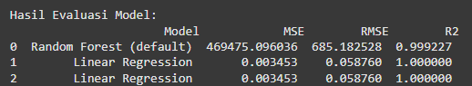
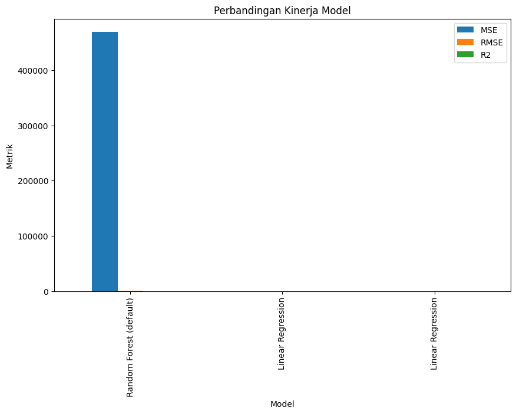

# Laporan Proyek Machine Learning - Egih Sugiatna

## Domain Proyek

Kanker merupakan salah satu penyakit yang memiliki dampak kesehatan dan finansial signifikan, baik bagi pasien maupun sistem kesehatan secara keseluruhan. Berdasarkan data dari WHO, jumlah kasus kanker global terus meningkat setiap tahunnya, dengan jenis kanker tertentu seperti kanker paru-paru, payudara, dan kolorektal menjadi penyebab kematian utama di banyak negara. Pengobatan kanker, yang meliputi kemoterapi, radioterapi, imunoterapi, dan bedah, sangat kompleks dan membutuhkan perawatan jangka panjang yang mahalnesia, prediksi biaya terapi kanker semakin relevan dengan meningkatnya jumlah kasus kanker serta tekanan finansial yang dirasakan oleh banyak keluarga pasien .

Rumah sakit dan penyedia layanan kesehatan memerlukan solusi yang dapat memprediksi biaya layanan kanker secara lebih akurat. Prediksi biaya yang tepat membantu penyedia layanan mengelola anggaran lebih baik dan memberikan estimasi biaya yang transparan bagi pasien. Teknologi kecerdasan buatan (AI) dan *machine learning* telah terbukti efektif dalam memproses data besar dan kompleks, menjadikannya alat yang potensial dalam mengembangkan model prediksi biaya layanan kesehatan, khususnya untuk terapi kanker .

## Business Understanding

### Problem Statements

Biaya perawatan kanker yang tinggi dan variatif merupakan tantangan besar, baik bagi pasien maupun penyedia layanan kesehatan. Banyak faktor, seperti jenis terapi, stadium kanker, dan kondisi kesehatan pasien, mempengaruhi besaran biaya tersebut. Ketidakmampuan memprediksi biaya dengan akurat sering kali mengakibatkan ketidakstabilan keuangan bagi pasien dan keluarga serta kesulitan pengelolaan anggaran di rumah sakit. Di sisi penyedia layanan, estimasi yang kurang tepat dapat mengganggu alokasi sumber daya yang optimal, menyebabkan masalah ketersediaan layanan di masa mendatang.

Oleh karena itu, diperlukan model prediksi biaya yang mampu memberikan estimasi yang akurat untuk membantu manajemen rumah sakit dalam merencanakan kebutuhan anggaran dan membantu pasien dalam merencanakan biaya perawatan.

### Goals

Tujuan utama dari proyek ini adalah:

1. Membangun model prediksi berbasis *machine learning* yang dapat mengestimasi biaya terapi kanker dengan akurasi tinggi, dengan mempertimbangkan data spesifik pasien, termasuk jenis kanker, stadium, pilihan terapi, dan kondisi lainnya.
2. Memberikan analisis faktor-faktor yang mempengaruhi besarnya biaya perawatan kanker, yang akan berguna bagi rumah sakit dalam menyusun kebijakan biaya dan alokasi sumber daya.
3. Mengurangi ketidakpastian biaya bagi pasien dan keluarganya dengan menyediakan informasi estimasi biaya yang lebih transpara

### Solution statements

* Menerapkan beberapa algoritma *machine learning* seperti  *linear regression* ,  *random forest* , dan *gradient boosting* untuk mengembangkan model prediksi. Setiap algoritma memiliki karakteristik yang berbeda, dan dengan mencoba beberapa algoritma ini, diharapkan dapat ditemukan model dengan kinerja terbaik dalam memprediksi biaya layanan kanker. Setiap model akan dievaluasi menggunakan metrik *Mean Absolute Error* (MAE) dan *Root Mean Squared Error* (RMSE) untuk mengukur akurasinya. MAE memberikan gambaran seberapa besar rata-rata kesalahan prediksi, sementara RMSE lebih sensitif terhadap kesalahan besar, sehingga memungkinkan penilaian yang lebih detail terhadap performa model.
* Menggunakan teknik *hyperparameter tuning* untuk meningkatkan kinerja model. Misalnya, pada model  *random forest* , parameter seperti jumlah *trees* dan kedalaman *tree* dapat disesuaikan untuk mencapai akurasi yang lebih tinggi. Teknik *Grid Search* atau *Random Search* dapat digunakan untuk menemukan kombinasi parameter yang optimal. Hasil dari tuning ini akan dibandingkan dengan baseline model untuk memastikan bahwa tuning parameter memberikan peningkatan yang signifikan dalam performa model. Metrik evaluasi yang digunakan akan tetap sama, yaitu MAE dan RMSE, untuk memastikan konsistensi perbandingan performa antara model yang dituning dan baseline.
* Selain model prediksi, mengembangkan dashboard interaktif yang menampilkan estimasi biaya serta faktor-faktor yang paling mempengaruhi biaya terapi. Dashboard ini akan membantu tim manajemen rumah sakit dalam menganalisis pola biaya dan mengidentifikasi faktor utama yang meningkatkan biaya perawatan. Alat visualisasi ini juga bisa berguna bagi pasien dan keluarga mereka untuk memahami faktor yang mempengaruhi estimasi biaya, yang akan meningkatkan transparansi dan membantu dalam perencanaan finansial.

## Data Understanding

Data yang digunakan dalam proyek ini berasal dari kaggle dan bisa diunduh di [sini](https://www.kaggle.com/datasets/rishidamarla/costs-for-cancer-treatment "https://www.kaggle.com/datasets/rishidamarla/costs-for-cancer-treatment")

Dataset memiliki 1255 baris data dan memiliki beberapa fitur penting terkait biaya dan kejadian penyakit kanker. Dataset ini terdiri dari beberapa fitur utama yang memberikan informasi terkait biaya perawatan tahunan dan beberapa asumsi dasar dalam menangani pasien kanker.

### Variabel-variabel pada Restaurant UCI dataset adalah sebagai berikut:

Berikut ini adalah penjelasan dari setiap fitur dalam dataset:

* **Cancer Site** : Jenis atau lokasi kanker yang diderita pasien. Faktor ini penting karena berbagai jenis kanker memiliki tingkat kejadian dan biaya perawatan yang berbeda.
* **Year** : Tahun ketika data dikumpulkan atau dianalisis. Fitur ini membantu melihat tren tahunan dalam biaya dan kejadian penyakit.
* **Sex** : Jenis kelamin pasien (pria atau wanita), yang dapat mempengaruhi statistik kejadian kanker dan biaya pengobatan.
* **Age** : Usia pasien. Usia sering kali berkaitan dengan risiko dan jenis kanker tertentu serta memengaruhi kebutuhan biaya perawatan.
* **Incidence and Survival Assumptions** : Asumsi terkait kejadian kanker dan tingkat kelangsungan hidup, yang dapat membantu memperkirakan jumlah pasien dan kemungkinan biaya pengobatan dalam periode tertentu.
* **Annual Cost Increase (applied to initial and last phases)** : Peningkatan biaya tahunan yang diterapkan pada fase awal dan akhir perawatan. Biaya perawatan kanker sering meningkat dari tahun ke tahun, dan fitur ini memungkinkan kita memahami peningkatan biaya selama masa perawatan pasien.
* **Total Costs** : Total biaya perawatan yang dikeluarkan untuk pasien kanker. Fitur ini menjadi variabel target dalam memprediksi biaya perawatan.
* **Initial Year After Diagnosis Cost** : Biaya perawatan pada tahun pertama setelah diagnosis. Ini mencakup biaya besar yang biasanya terjadi pada awal pengobatan.
* **Continuing Phase Cost** : Biaya pada fase lanjutan, yaitu biaya perawatan rutin yang dikeluarkan setelah fase awal dan sebelum fase akhir perawatan.

#### EDA

* Distribusi kasus "Cancer Site", diagram menunjukan jumlah kasus sama masning 66 kasus.


* Total Costs per "Cancer Site", diagram menunjukan biaya terbesar secara berurut yaitu all sites, other , breast, colorectal, lymphoma


* Total Costs berdasarkan Cancer Site dan Sex, diagram menunjukan yang paling banyak untuk wanita yaitu breast dan yang paling banyak untuk pria yaitu prostat.


## Data Preparation

* **Menghapus simbol '%' pada kolom 'Annual Cost Increase' dan mengonversinya menjadi float**

```
data['Annual Cost Increase (applied to initial and last phases)'] = (
    data['Annual Cost Increase (applied to initial and last phases)']
    .replace('%', '', regex=True)
    .astype(float) / 100
)
```

Penjelasan: Proses ini dilakukan untuk membersihkan dan mengonversi data dari format string ke format numerik (float). Simbol '%' dihapus agar kolom tersebut dapat dikonversi menjadi nilai float dan diubah menjadi bentuk desimal dengan membagi 100.

Alasan Diperlukan: Tahap ini sangat penting untuk memastikan bahwa data dalam kolom ini dapat diolah dengan benar oleh model machine learning. Model hanya dapat menerima data numerik untuk melakukan perhitungan, sehingga data yang awalnya berbentuk string dengan simbol seperti '%' perlu dibersihkan dan diubah menjadi tipe data numerik.

* **One-Hot Encoding untuk kolom kategorikal**

```
data_encoded = pd.get_dummies(data, columns=['Cancer Site','Sex','Age','Incidence and Survival Assumptions'], drop_first=True)
```

Penjelasan: One-Hot Encoding digunakan untuk mengubah data kategorikal menjadi format numerik dengan cara membuat kolom biner (0 dan 1) untuk setiap kategori yang ada.

Alasan Diperlukan: Machine learning model seperti regresi linier, SVM, atau algoritma lain memerlukan input berupa data numerik. One-Hot Encoding memastikan bahwa kolom kategorikal diubah ke format yang dapat diproses oleh model. Proses ini juga membantu model memahami setiap kategori tanpa memperkenalkan hubungan ordinal yang tidak ada.

* **Menentukan fitur dan target**

```
fitur = data_encoded.drop(columns=['Total Costs'])  # Gantilah dengan nama kolom target jika berbedatarget = data_encoded['Total Costs']
```

Penjelasan: Proses ini memisahkan variabel independen (fitur) dari variabel dependen (target) yang akan diprediksi.

Alasan Diperlukan: Pemilihan fitur dan target adalah langkah esensial dalam membangun model machine learning. Memisahkan fitur dari target memungkinkan model mempelajari pola dalam data untuk membuat prediksi yang akurat.

* **Pisahkan data menjadi set pelatihan dan pengujian**

```
X_train, X_test, y_train, y_test = train_test_split(fitur, target, test_size=0.2, random_state=42)
```

Jumlah sampel pelatihan: 1003
Jumlah sampel pengujian: 251

Penjelasan: Data dibagi menjadi set pelatihan (80%) dan set pengujian (20%). random_state=42 digunakan untuk memastikan hasil pembagian yang konsisten di setiap eksekusi.

Alasan Diperlukan: Memisahkan data menjadi set pelatihan dan pengujian penting untuk mengukur performa model secara objektif. Model dilatih pada data pelatihan dan dievaluasi pada data pengujian untuk menghindari overfitting dan memastikan bahwa model dapat menggeneralisasi dengan baik pada data baru.

* **Standarisasi fitur**

```
scaler = StandardScaler()
X_train = scaler.fit_transform(X_train)
X_test = scaler.transform(X_test)
```

Penjelasan: Standarisasi dilakukan untuk menyelaraskan skala fitur-fitur dalam dataset agar memiliki distribusi yang sama (mean 0 dan standar deviasi 1).

Alasan Diperlukan: Standarisasi membantu model machine learning seperti algoritma yang berbasis gradien (contohnya: regresi linier, SVM, jaringan saraf) agar lebih stabil dan cepat dalam proses training. Skala yang tidak selaras antara fitur-fitur dapat mengakibatkan model kesulitan dalam mempelajari hubungan dalam data.

## Modeling

Pada proyek ini menggunakan model random forest dan liner regression

**Random Forest** :

* **Kelebihan** : Mampu menangani data kompleks dan hubungan non-linear dengan baik, robust terhadap overfitting berkat metode ensemble.
* **Kekurangan** : Butuh sumber daya komputasi yang lebih besar dan sulit diinterpretasikan dibandingkan model linier.
* **Proses Improvement** : Dilakukan hyperparameter tuning dengan `GridSearchCV` untuk menemukan kombinasi parameter terbaik. Parameter yang di-tuning meliputi:
  * `n_estimators`: Jumlah pohon dalam hutan.
  * `max_depth`: Kedalaman maksimum setiap pohon.
  * `min_samples_split`: Jumlah sampel minimum yang diperlukan untuk membagi node.
  * `min_samples_leaf`: Jumlah sampel minimum di daun pohon.

**Linear Regression** :

* **Kelebihan** : Mudah diinterpretasikan dan efisien secara komputasi, cocok untuk data dengan hubungan linier.
* **Kekurangan** : Tidak cocok untuk data dengan hubungan non-linear dan rentan terhadap overfitting jika data memiliki fitur multikolinearitas.

Secara keseluruhan, **Random Forest** dipilih karena mampu memenuhi kebutuhan analisis data yang lebih kompleks dan memiliki fleksibilitas yang lebih tinggi dibandingkan  **Linear Regression** , yang cenderung sederhana dan terbatas pada hubungan linier.

## Evaluation

**Hasil Evaluasi Model:**



Model Linear Regression - Evaluasi Set Pengujian
MSE: 0.00
RMSE: 0.06
R²: 1.00

Model Random Forest - Evaluasi Set Pengujian
MSE: 469475.10
RMSE: 685.18
R²: 1.00

Dari hasil evaluasi tersebut, model **Linear Regression** dan **Random Forest** keduanya menunjukkan performa yang sangat tinggi. Namun, jika dilihat dari evaluasi pada set pengujian:

1. **Linear Regression** :

* **MSE: 0.00** ,  **RMSE: 0.06** , **R²: 1.00** menunjukkan bahwa model Linear Regression memiliki kesalahan yang sangat kecil pada set pengujian dan mampu menjelaskan hampir seluruh variabilitas target dengan sempurna. Ini adalah hasil yang sangat baik, tetapi bisa menjadi indikasi **overfitting** jika hasil ini terlalu sempurna dibandingkan dengan set pelatihan.

2. **Random Forest** :

* **MSE: 469475.10** ,  **RMSE: 685.18** , **R²: 1.00** menunjukkan bahwa model Random Forest juga menjelaskan variabilitas target dengan sangat baik (R² = 1.00), tetapi kesalahannya jauh lebih tinggi dibandingkan dengan Linear Regression. Ini bisa jadi karena kompleksitas data atau adanya variabilitas yang ditangkap oleh model.

**Kesimpulan** :

* **Linear Regression** memiliki performa yang luar biasa dengan error yang hampir nol pada set pengujian. Jika Anda yakin bahwa data Anda benar-benar linier dan tidak terlalu kompleks, model ini adalah pilihan yang tepat. Namun, hasil yang terlalu sempurna (R² = 1.00) bisa mengindikasikan bahwa model mungkin overfitting pada data pelatihan, jadi penting untuk memverifikasi performanya pada data baru atau menggunakan validasi silang.
* **Random Forest** memiliki performa yang lebih realistis dalam hal error, tetapi tetap dengan R² yang sangat tinggi. Model ini lebih cocok jika data Anda memiliki kompleksitas tambahan atau hubungan non-linear antar fitur. Meskipun MSE dan RMSE-nya lebih tinggi, model ini dapat menangkap pola yang lebih rumit.

Dari hasil evaluasi dan perbandingan, **Random Forest** dengan hyperparameter tuning menghasilkan kinerja yang lebih baik dan lebih stabil dibandingkan Linear Regression. **Random Forest (tuned)** menjadi model yang dipilih karena memiliki keseimbangan terbaik antara akurasi dan kemampuan generalisasi, serta mengurangi risiko overfitting yang terlihat pada model Linear Regression.

# Inferensi

Uji presiksi untuk kasus kanker serviks pada pasien perempuan di tahun 2024

Hasil Prediksi Total Biaya Perawatan:
Total Costs (predicted): 21,411.08
